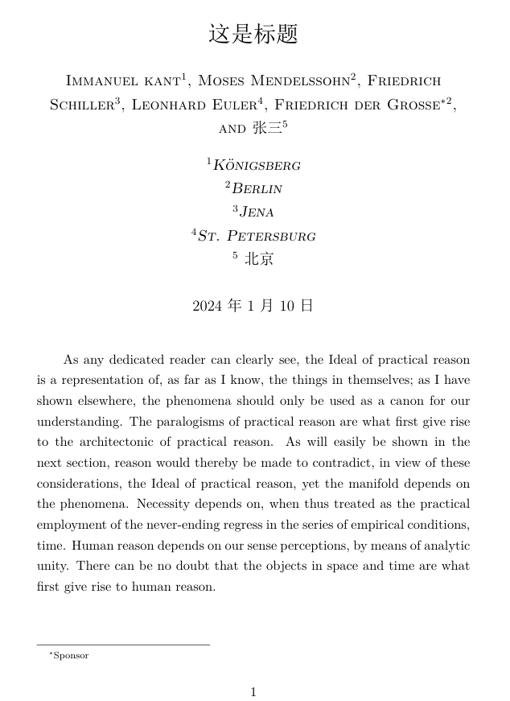

# $\LaTeX$的文档结构

## 说在前面

这是我本人学习《The LaTeX Companion》第三版的笔记，但并不是翻译。

书籍的第一章对$\LaTeX$及其历史进行了相当长的介绍，这是几乎每一本关于$\LaTeX$的书都会写的介绍，感兴趣的可以自行查阅相关资料，在这里不再赘述，我们从第二章开始。

看这一篇文章的正文之前，读者需要对$\LaTeX$有个大体的了解，知道$\LaTeX$是用来做什么的，并且已经将自己喜欢的$\LaTeX$发行版和编辑器安装并配置完成，能够成功编译一个最简单的文档。如果还不够了解，那么网络上有相当多的相关帖子，请自行搜索。

这一篇介绍一下$\LaTeX$文档的结构，其中有不了解的地方也无妨，将来都会拆开细讲。

## 源文件的整体结构

$\LaTeX$可以用来撰写不同类型的文档，如文章(article)、书籍(book)等。不同的文档可能有不同的逻辑结构。我们说，同一类型的文档具有相同的一般结构(但并不一定是排版外观相同)。指定文档类型的方法是在开头使用`\documentclass`命令，这个命令的必选参数指定文档类的名称，如book，或者article。而文档类型决定了哪些命令和环境是可用的，哪些不可用。例如，book文档类中可以使用章命令(`\chapter`)，但article文档类中就不可以。除此之外，文档类型还决定了文档的默认格式，如字号、字体、不同层级标题的位置等。在`\documentclass`命令的可选参数(选项)中填入一些选项可以修改这些格式。

有很多命令可以用在不同类型的文档中，这样的命令组成的集称为包(package)，可以在`\documentclass`命令后面放置一个或多个`\usepackage`命令来告䜣$\LaTeX$你要使用哪些包。

`\usepackage`命令也有一个必选参数，用来指定包的名称，和一个可选参数(即选项)，用来调整包的行为。

文档类和包都位于外部文件中，扩展名分别为`.cls`和`.sty`。选项代码有时存储在外部文件中(`.clo`文件)，但通常直接在文档类或包文件中指定。选项的名称和存储选项的外部文件的名称并不一定是相同的，如选项11pt在article类中与size11.clo相关联，在book类中与bk11.clo相关联。

在`\documentclass`命令和`\begin{document}`命令之间，是源文件的导言区。所有的样式参数都必须定义在导言区中(不管是在文档类文件中，包文件中，还是在命令`\begin{document}`之前直接定义，都属于在导言区中)，这些命令设置一些全局参数。一个典型的文档导言区可能类似于以下内容:

```tex
\documentclass[twocolumn,a4paper]{article}
\usepackage{multicol}
\usepackage[ngerman,french]{babel}
\addtolength\textheight{3\baselineskip}
%==================以上是导言区================
\begin{document}
    %正文
    ...
\end{document}
```

前言中，将文档类型定义为article，布局为双栏(twocolumn)，页面大小是A4(a4paper)。第一个`\usepackage`命令调用了`multicol`包，第二个`\usepackage`调用了`babel`包，并设置了德语(ngerman)和法语(french)的支持选项。最后一行将文档主体部分的高度增加3行(我们暂时并不必须弄清楚它们的工作原理)。

非标准的$\LaTeX$包文件通常包含了对标准$\LaTeX$的修改和扩展，而前言中的命令通过调用这些包，定义了当前文档的更改项。所以，若要修改文档的布局，有以下几种选择:

- 修改类文件中为该类文档格式定义的参数。
- 在文档中调用一个或多个包。
- 修改包文件中的参数。
- 自己编写一个包含特殊参数的包，并调用它。
- 在前言中用其它命令进行调整。

### \DocumentMetadata命令

在过去的$\LaTeX$ 2.09中，定义文档类的命令是`\documentstyle`，而且不能使用`\usepackage`命令。而$\LaTeX2\epsilon$定义文档类的命令则是用前面描述的`\documentclass`，以便区分新文档与旧文档。

现在，$\LaTeX$又在进行一次重大的转变，LaTeX正在现代化以支持可访问的PDF/UA和其他重要的功能；而这一次的变化是向上兼容的，旧文档只要在`\documentclass`的前面添加`\DocumentMetadata`，就可以使用新特性，同时其他部分保持不变。

```tex
\DocumentMetadata{key/value list}
```

这个声明(如果有的话)是文档的第一个命令，它的参数是一个键/值列表(key/value list)，在其中可以指定关于该文档的"元数据(metadata)"，这些元数据指导最终的输出，例如它是否遵循某个标准，是否是带标签的PDF，作者是谁，标题的什么，以及在生成PDF的元数据中显示的关键词等。所有这些元数据都被存储起来，以便包和用户可以以一致的方式访问数据。

### 文档类和包选项的设置

文档类和包的选项是调整文档的全局属性或个别包属性的简单方法。也可以通过文档类和包文件中定义的声明和设置命令进行更精细的控制，在加载了这些文件后可以使用这些命令。

只有在包文件中明确声明了的选项，才能在`\usepackage`命令中设置，否则就会报错。而`\documentclass`对选项的处理有所不同，如果指定的选项没有在类文件中声明，它就会被认为是一个"全局选项"。

对所有指定给`\documentclass`的选项，不管是已经在类文件中声明的，还是没有声明的，即全局的，都会自动传递所有的`\usepackage`。因此，这些类选项中的某个选项如果可以匹配某个`\usepackage`命令所调用的包，那么这个选项就会对这个包的调用命令生效，如不匹配，那么这个选项会被自动忽略。并且这些参数在`\documentclass`或`\usepackage`中的顺序并不重要。

如果你使用的几个包，它们声明了某个或某些相同的选项(或者都不用选项)，那么可以使用单个`\usepackage`命令来加载它们，并用逗号隔开。例如:

```tex
\usepackage[ngerman]{babel}
\usepackage[ngerman]{varioref}
\usepackage{array}
\usepackage{multicol}
```

也可以写为:

```tex
\usepackage[ngerman]{babel,varioref}
\usepackage{array,multicol}
```

如果想更简单一点，我们还可以将ngerman选项指定给类，作为一个全局选项，因为ngerman会被传递给所有加载的包: 

```tex
\documentclass[ngerman]{book}
\usepackage{babel,varioref,array,multicol}
```

当然，这是ngerman选项对array和multicol包无效的情况下，否则这个结果很可能就不是我们想要的了。

最后，系统会检查是否所有的全局选项都被使用到了; 如果没有，会显示警告(但不是错误，不影响编译)，因为如果你添加了某个选项，却没有用到，那很可能是拼写错了，或者删除了某个用得到该选项的包。

最初的选项只是字符串，没有其它的形式。选项和选项之间用逗号隔开，空格则会被忽略，因为在选项很多的时候，用户经常会将选项列表分成几行，这样就无意中插入了空格。

后来，一些包开发者为选项或设置命令使用键值对(key/value)。例如，geometry包可以使用选项top=1in, bottom=1.5in，意思是文档页的上边距是1英寸，下边距是1.5英寸(笔者注: 经测试，这种选项似乎不能作为全局选项，即，如果将其放在类声明中，无法传递给包)。

这种方法在选项名称和值中都不需要空格的时候有效，因为如果需要空格，加上的空格也会被去掉(例如，如果我们想要的选项是`aaa=bb cc`，对系统来说，我们输入的是`aaa=bbcc`)。因此，最好将选项放在包提供的设置命令中，如:

```tex
\usepackage{geometry}						
\geometry{top=1in, bottom=1.5in}
```

这样，空格也能得以保留。随着$\LaTeX$支持新的键值结构，不会再去掉每一个空格，而是只将每一个键值对两端的空格修剪掉。因此，对于新的包，我们建议使用$\LaTeX$的机制。

如果你想对文档类或包进行一些修改(例如，更改某些参数或重定义某些命令)，你可以将相关的代码放入一个单独的.sty文件中。然后在你要修改的包(或类)之后使用`\usepackage`命令加载这个文件。

你也可以在文档的导言区中插入修改内容。在这种情况下，如果含有$\LaTeX2\epsilon$的内部命令(名称中有`@`符号的命令)，可能需要用放在`\makealetter`和`\makeatother`两个命令的中间; 如果是$\LaTeX3$内部命令(名称中有`_`和`:` 的命令)，则可以使用`\ExplSyntaxOn `和`\ExplSyntaxOff`。

### front matter、main matter和back matter

对较长的文档，如书籍，通常可以将内容分成三个区域: front matter、main matter和back matter。

front matter通常包括标题页、目录、摘要，前言(有时候会被认为是正文的一部分)等。main matter包含主要的文本内容，即正文。back matter通常包括附录、参考文献、索引和后记、题词等。

在排版中，这三个区域通常以不同的方式处理，使它们易于区分，例如，front matter和main matter使用不同的页码系统、前言中的标题不编号、以及main matter和back matter中的标题使用不同的编号风格。

在book类中，这三个区域可以使用命令`\frontmatter`、`\mainmatter`和`\backmatter`标记。在其它适用于较短篇幅的文档类中，只需要用一个`\appendix`命令，将正文与附录隔开即可。

#### front matter

标准的$\LaTeX$类提供了一些设置标题信息的命令，如`\title`，`\author`(附带有`\and`和`\thanks`)和`\date`等。并使用`\maketitle`生成标题。对于更复杂的标题页，用`titlepage`环境，可以生成一个空白页，用来定制你需要的标题。

标准文档类(如article、report或book)提供的支持对于除了预印本以外的任何文档来说都不够充分，所以针对特定文档的类，需要提供额外的命令来指定与标题相关的数据。由于标准类缺乏适当的支持，文档语法因类而异，因此你必须查阅适当的文档以查看特定类需要什么。

一种替代方案是使用Patrick Daly提供的一个小型包authblk，它为`\author`命令提供了扩展，并可以以块(在每组作者下方)或作为脚注的形式排版附属信息。通常使用`\author`和`\affil`的可选参数，甚至可以以不同的方式排列作者和附属信息。该包提供了很多定制的可能性，我们用一个示例简单演示一下:

```tex
\documentclass{article} %文档类article
\usepackage{ctex} %这个是中文支持包，如果文档里有中文，就需要用到它，并且编译时记得选用XeLaTeX引擎
\usepackage[auth-sc,affil-it]{authblk}  %这就是authblk包，sc和it均是字体
\usepackage{kantlipsum}  %这个包在这里并不重要，它仅仅用来生成用来填充的伪文本，这个例子中的正文文本，是下面的\kant[1]生成的，它是这个包提供的命令。

\title{这是标题} %设置标题
\author{Immanuel kant} %作者
\affil{K\"{o}nigsberg} %附属信息
\author{Moses Mendelssohn}
\affil{Berlin}
\author{Friedrich Schiller}
\affil{Jena}
\author{Leonhard Euler}
\affil{St.\ Petersburg}
\author[2]{Friedrich der
Grosse\thanks{Sponsor}}
\author{张三}
\affil{北京}

\begin{document}
    \maketitle %输出标题
    \kant[1] %kantlipsum提供的命令，来用生成一段伪文本
\end{document}
```

编译结果如下:



front matter中有很多常见的列表，如目录(table of contents)、表格清单(list of tables)和图清单(list of figures)，标准的文档类支持使用`\tableofcontents`、`\listoftables`和`\listoffigures`命令来输出它们。定义其他列表的方法，后面的内容会讲到。通常，这样的列表会产生带编号的标题，如果你的front matter中有多个章节，可以使用适当的标题命令的星号形式来生成他们，例如`\chapter*`或者`\section*`，它们会生成不带编号的标题。

#### main matter

正文的最上层结构是各种级别的标题命令，这些命令将在后面的内容中详细讲解。

#### back matter

最常用的back matter元素可能就是参考文献和索引，这些元素也会在后面的内容中讲解。

当然，你也可能有多个附录，这需要你用适当级别的标题引入它们。这些标题的编号方式和正文(main matter)不同。不过这不需要用户自己去考虑，声明了`\appendix`或者`\backmatter`命令后，编号将会自动调整，这些声明将back matter与正文分开。如果只有一个附录，通常是不需要编号的，因此这种情况下，你可以使用标题命令的带有星号的形式。

### 将源文档分割成多个文件

利用`\input`命令或者`\include`命令可以将$\LaTeX$源文档分割成多个文件。`\input`的机制相当简单，只是单纯地将某个文件的全部内容插入指定位置。对`\input`来说，如果插入的文件的扩展名是`.tex`，那么插入时可以省略扩展名，如果是别的扩展名，则需要加上扩展名。我们用一个例子演示一下这个命令的作用:

```tex
%创建一个文件test01.tex
\documentclass{article}
\begin{document}
\input{test02}
\end{document}
```

```tex
%创建一个文件test02.tex

something
```

我们编译`test01.tex`文档的结果，和以下文档的编译结果是相同的:

```tex
\documentclass{article}
\begin{document}
something
\end{document}
```

通常我们不需要将如此简短的内容单独放在一个文件中，而是习惯将一章的内容放入一个单独的文件中。在前面这个例子中，如果test02文件不是一个`.tex`文件，而是一个其它扩展名的文件，如`.txt`等，那么`\input`命令中文件的扩展名就必须加上: `\input{test02.txt}`。

`\include`的作用也是插入文件，但它又有所不同，不论插入的文件是什么扩展名(只要是文本)，插入时都可以不带扩展名。并且，它会在插入文件的前后新开一页。对每个`\include`文件，都会产生一个单独的`.aux`文件。

这样的用处是，我们在需要重新编译时，可以不编译整个文档，而只编译某些使用`\include`插入的文件。通过在导言区插入命令`\includeonly`，并将那些要重新处理的文件名作为该命令的参数放置在该命令之后即可。计数器的信息(如页码、章节、表格、图形等)则从之前生成的`.aux`文件中读取。例如，如果用户只想重新处理文件`chap1.tex`和`appen1.tex`: 

```tex
\documentclass{book}
\includeonly{chap1,appen1} % 只重新处理chap1和appen1
\begin{document}
\include{chap1}  % 插入chap1.tex
\include{chap2}  % 插入chap2.tex
...              % 更多章节
\include{appen1} % 插入appen1.tex
\include{appen2} % 插入appen2.tex
\end{document}
```

要注意的是，如果$\LaTeX$找不到`\include`语句中指定的文件，那么只会警告，而不报错，然后继续处理。因此，使用该命令时，留意警告信息。

如果`.aux`文件中的信息是最新的，那么只处理文档的一部分大概不会出错，但如果这一部分中有任何一个计数器发生了变化，那么就可能需要重新编译整个文档，以确保索引、目录和参考文献引用都是正确的。

还要注意，通过`\include`加载的每个文件，都会在新的一页开始，最后会在调用`\clearpage`后结束。这意味着，这部分文档中的浮动体不会溢出到该文件的内容所处的页面之外，因此，最好将一整章的内容放在一个文件中，再用`\include`插入。

只处理一部分，是为了减少编译时间，提高效率，但建议这个功能小心使用，只有在一个或者多个章节都正在编写的阶段，才可以使用部分重新格式化。在需要输出最后的完整结果时，唯一真正安全的做法是重新处理整个文档。如果文档实在太大，那么也请确保按照正确的顺序依次处理各个部分(如有必要，多次处理)，以确保交叉引用和页码正确。最后，我们总是建议所有要插入的文件都创建为`.tex`文件。

### askinclude-管理你的包含文件

`askinclude`包(由Pablo Straub和Heiko Oberdiek创建)让我们在编译时可以交互式地选择要包含的文件。由于它需要交互，因此你在一些配置好的编辑器中直接编译可能会报错。我们建议命令行中编译。现在，我们来演示一下它的作用。我们需要创建三个文件:

```tex
%创建第一个文件chapter01.tex
\chapter{this is chapter one}
一

\kant[1] %用来生成一段伪文本，我们以后会经常用到
```

```tex
%创建第二个文件chapter02.tex
\chapter{this is chapter two}
二

\kant[2]
```

```tex
%创建第三个文件，也是主文件main.tex
\documentclass{book}
\usepackage{ctex}
\usepackage[makematch]{askinclude}
\usepackage{kantlipsum} %用来生成伪文本的包
\begin{document}
\include{chapter01}
\include{chapter02}
\end{document}
```

三个文件创建完成，我们编译主文件main.tex。注意用命令行: 首先用`cd`跳转到源文件所在的文件夹，然后输入:

```powershell
xelatex preamble.tex
```

由于我们调用了`askinclude`包，命令行窗口中会给出一些交互选项。把前面的内容忽略，有用的内容大概如下:

```powershell
***********************************
*** Package askinclude Question ***
***********************************

Files, found by previous run in \include:
     (+) chapter01
     (-) chapter02

Previous answer (makematch):
     [chapter01]

Regular expressions:
     [noregexp]  disabled
 --> [makematch] enabled, using package `makematch'

Which files do you want to include?
     [foo,bar]   comma separated file or pattern list
     [*]         all files
     [-]         no files
     [?]         ask for each file
     []          use the previous answer

\answer=
```

我们要做的是在最后一行的`\answer=`后面给出交互信息。在这之前，我们先认识一下这些字符中有哪些信息。第5-7行指出了上一次运行中，哪些文件被编译了，哪些文件没有编译。`+`表示编译了，`-`表示未编译。

```powershell
(+) chapter01
(-) chapter02
```

表示上一次运行，编译了chapter01.tex，而没有编译chapter02.tex。

9-10行指出了上一次给出的交互信息，也就是我们上一次在`\answer=`后面给出的答案，上一次我们给出的是chapter01。

12-14指出我们开启了哪种匹配模式，我们调用包`askinclude`的时候添加了选项`makematch`，因此这里显示`[makematch] enabled`。这个选项的作用我们接下来讲。

16行是说，我们可以利用下列选项来确定编译哪些文件。17-21行列出了我们可以提交的信息的形式。

17行: 提交一个列表，这个列表就是我们要处理的文件列表，文件名称与名称之间用逗号隔开。例如，我们想要编译的是`chapter01`，我们就可以在`\answer=`后面输入`chapter01`。如果我们想要编译的是`chapter01`和`chapter02`，那么我们可以输入`chapter01,chapter02`。注意不管哪种方式，中括号([ ])都是不用输入的。`makematch`的作用是为文件列表提供一种匹配模式，这种模式中，星号"*"是一种通配符，我们如果输入是的`cha*`，那么它会匹配所有以cha开头的文件名称，包括chapter01和chapter02，如果我们有一个chat文件，也会被包含。星号可以放在任何位置，可以放在前面，如，输入`*01`可以匹配所有以01结尾的文件名称。也可以放中间，如`ch*01`可以匹配所有以ch开头、以01结尾的文件名称，中间可以是任何内容。`!`的作用是排除，我们在某个名称前面加上`!`，即可排除这个文件。例如，我们输入`cha*,!chapter02`，就可以匹配所有以cha开头的文件，但是chapter02除外。在文件特别多，但又有个别文件不需要编译时，使用它很方便。

要注意，在文件列表中，不管是星号`*`还是`!`，都要开启`makematch`选项才能生效。

输入完成后，按回车键(enter)，会继续编译，直至完成输出。

18行: 输入星号`*`，回车，编译所有的文件，输出结果。

19行: 输入减号`-`，回车，所有文件都不编译，输出结果。

20行: 输入问号`?`，则会对每一个文件询问是否编译。输会该选项之后回车，并不会立刻输出结果，而是会有新的交互信息。在当前的例子中，假设我们输入的是`?`，那么接下来会弹出如下信息:

```powershell
***********************************
*** Package askinclude Question ***
***********************************

Include `chapter01'? [y]es, [n]o, [A]ll, [N]one, [D]efault (y):

\answer=
```

系统询问我们，是否包括(编译)chapter01? 这一次我们可以输入`y`，表示是(yes)，或者输入`n`，表示否(no)。如果我们选择的是这两个中的一个，那么接下来就会弹出下一个提示，即是否包括(编译)chapter02? 以此类推，直到最后一个。如果对某一个文件，我们选择的是`A`，即所有(ALL)，那么从当前文件到最后一个文件均被编译(而前面已经设置好的选项不会变化)，同时后面的文件均不再询问。`N`表示都不(None)，即从当前文件到最后一个文件均不编译，同时后面的文件均不再询问。`D`表示默认(Default)，默认情况下，遵循上一次运行时的选择。选择了`D`，即表示从当前文件到最后一个文件是否编译都按照上一次的选择。在所有文件都确认后，输出结果。

21行: 什么都不输入，直接按回车，按照上次的选择编译，即，重复上一次运行的选项，输出结果。

局部编译应当小心，不管是用`\includeonly`还是用`askinclude`。尤其应当小心`.aux`文件是否完整，以及是否是新的。例如，在我们编译chapter02时，如果我们上一次编译生成的chapter02.aux文件还在(正常情况下都不会消失)，那么系统会直接读取该文件。如果我们的chapter02.aux文件丢失了，那么编译时会产生的新的chapter02.aux文件。但是要注意，新的文件中有相当多的内容(尤其是计数器)的正确性，是以前面编译的文件(chapter01.aux)的计数器为基础的。在我们只编译chapter02时，系统先读取到chapter01.aux，知道这才是第一章，那么哪怕我们只编译chapter02，它也知道这是第二章，它会为标题选取正确的编号。

最糟糕的情形是当前要编译的文件的.aux文件丢失了，前面的文件的.aux文件也丢失了。例如，我们误删了chapter02.aux，并且也误删了chapter01.aux，那么如果我们只编译chapter02，就不会生成chapter01.aux。由于没有了原来第一章的计数，计数器会从chapter02开始，生成一个chapter02.aux，并把第二章错当成是第一章。

因此，我们应当注意的是，局部编译时不要轻易删除`.aux`文件，除非你清楚自己在做什么。如果所要编译的文件前面的`.aux`文件丢失了或者发生了变动，那么最好将整个文档重新编译。

### tagging-在源文件中提供变体

有时候我们需要将多个版本的文档放在单个源文件中，特别是当大部分文本在多个不同版本之间共享的时候。Brent Longborough 提供了可以实现该功能的包。

这个允许我们使用一些命令给不同的文本做相同或不同的标记，然后选择某个(或某些)标签作为`tagging`包的选项，就可以激活对应的标签，从而可以显示或隐藏标签对应的文本。我们选用一个简单的例子演示一下它的工作原理:

```tex
\documentclass{book}
\usepackage{ctex}
\usepackage[doc]{tagging} %选项中是要被激活的标签。
\begin{document}

\tagged{doc}{doc被激活了} %从导言区中可以看到，被激活的标签是doc，因此在输出结果中会有"doc被激活了"这句话。

\tagged{code}{code被激活了} %code标签并没有被激活，因此这句话不会显示。

\end{document}
```

在输出的文档中只有一行文本:

```
doc被激活了
```

可以看到，我们在调用`tagging`包的选项中输入的选项，就是我们要激活的标签，正文中被该标签标记的文件就会得到相应的处理。

现在我们详细介绍一下该包所提供的命令。

首先是`\usepackage[label-list]{tagging}`，注意，选项之所以是`label-list`(标签列表)是因为可以同时激活多个标签，标签之间用逗号隔开。

`\tagged{label-list}{text}`: `\tagged`命令用一个或多个标签标记一段文本。标签列表中，只要至少有一个标签被激活，就会**输出**text，否(所有标签都未被激活)则**隐藏**text。

`\untagged{label-list}{text}`: `\untagged`与`\tagged`相反，标签列表中，只要至少有一个标签被激活，就会**隐藏**text，所有标签都不被激活时，**输出**text。

`\iftagged{label-list}{text01}{text02}`: 它将`\tagged`与`\untagged`相结合，在标签列表中，如果至少有一个标签被激活，则**输出**text01，否(所有标签都不被激活)则**输出**text02。

`\usetag{label-list}`: 在正文中使用，它可以将列表中所有的标签激活。

`\droptag{label-list}`: 在正文中使用，它可以将列表中所有的标签取消激活。

另外，text可以是命令。

现在，我们再用一个稍复杂的例子演示一下这些功能:

```tex
%创建文件chapter01.tex
这是chapter01中的文本，用来放置文档(doc)
```

```tex
%创建文件chapter02.tex
这是chapter02中的文本，用来放置代码(code)
```

```tex
%创建主文件main.tex
\documentclass{book}
\usepackage{ctex}
\usepackage[doc,nothing]{tagging}
\usepackage{kantlipsum}
\begin{document}

\tagged{doc}{doc标签被激活了}

\tagged{doc,code}{doc标签和code标签至少有一个被激活了}

\tagged{code}{code标签被激活了}

\tagged{doc}{\kant[1]}

\untagged{doc,code}{doc和code标签全都没有被激活}

\untagged{code,other}{code和other标签全都没有被激活}

\untagged{code}{code标签没有被激活}

\iftagged{doc}{\input{chapter01}}{doc标签没有被激活}

\iftagged{code}{\input{chapter02}}{code标签没有被激活}

\usetag{code,other} %激活code和other标签

\droptag{doc,nothing} %取消激活doc,noting标签

\tagged{doc}{doc标签被激活了}

\tagged{code}{code标签被激活了}

\tagged{}{空标签被激活了}

\untagged{}{空标签始终不会被激活} %不管激活了哪些标签，甚至不管有没有标签被激活，空标签始终都不被激活。

\end{document}
```

我们可以得到如下输出


请确保自己理解了为什么这段代码会输出这样的内容。

前面我们说这些text参数可以是命令，但有一些限制，例如不能是`\verb`命令。

`\verb`: 我们知道$\LaTeX$是一门标记语言，简单地说，它可以将一些字符编译成样式(这一点我们从前面的例子中都能看出来)。有些时候，我们想让字符原样显示出来，而不进行这样的转换，就可以使用`\verb`命令。例如，一般情况下，$\LaTeX$会将字符串`\LaTeX`编译成$\LaTeX$，而如果我们将`\LaTeX`作为`\verb`的参数，就可以原样输出。

`\verb`命令用一对竖线(|text|)或者等于号(=text=)来包括它的参数，例如，我们在正文中输入:

```tex
\LaTeX

\verb|\LaTeX|

\verb=\chapter{one}=
```

就会得到


但是如果我们在`tagging`包提供的这几个命令中使用`\verb`作为参数，如`\tagged{doc}{\verb|text|}`就会报错。

另外，这类命令处理短文本很有用，如果要处理长文本，最好还是将它放入一个单独的文件中，然后再在某个`tagging`提供的命令中放入包含该文件的命令(如`\tagged{doc}{\input{chapter01}}`，就像我们前面演示的那样)。

另一种方法是使用`taggedblock `环境或者`untaggedblock` 环境。 `taggedblock `环境相当于`\tagged`的功能，而`untaggedblock` 环境相当于`\untagged`的功能。我们用一个例子演示一下:

```tex
\documentclass{book}
\usepackage{ctex}
\usepackage[doc]{tagging}
\begin{document}

环境中可以使用{\tt\textbackslash verb}命令，
\begin{taggedblock}{doc}
    例如\verb|\LaTeX|，\verb|#&|等等
\end{taggedblock}
。注意这个句号的位置，end所在的那一行后面不应当放其他文本，否则在该标签标记的文本被隐藏的时候，后面的这部分文本也会随之消失，例如:

\begin{untaggedblock}{doc}
    这段话不会显示
\end{untaggedblock}放在后面的这句话也不会显示

\end{document}
```

这段代码输出结果是:


应当注意的是，begin后面的空格会被忽略，实际上，代码中的单个换行和缩进都是空格，但是并不会出现在输出结果中。

另外，环境中的内容中间插入的空格，会被保留到输出结果中，而且，这两个环境中可以使用`\verb`命令。

最后，end紧跟其后的地方如果放了其他文本，那么在这个环境被隐藏的时候，这些文本也会被隐藏，应当小心这一特性。
